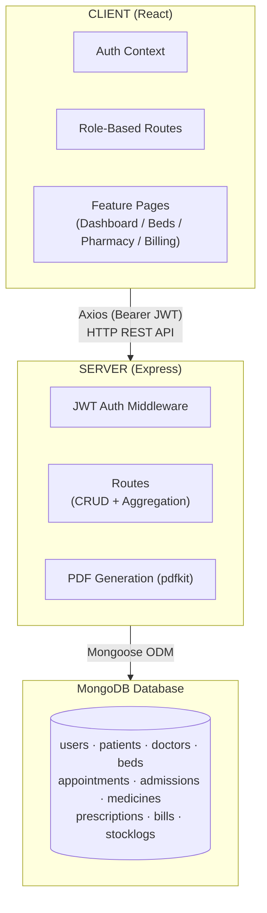
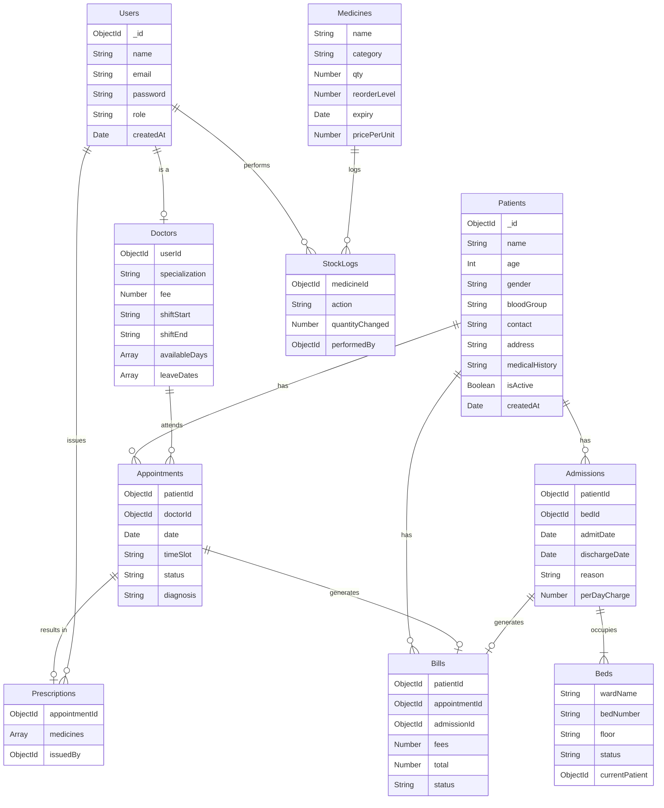
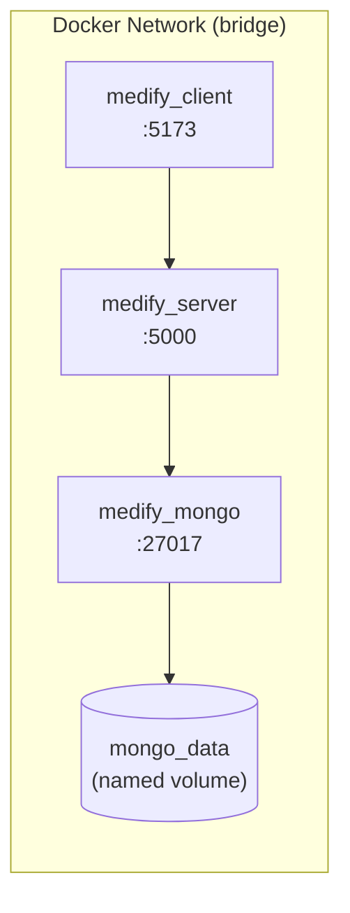
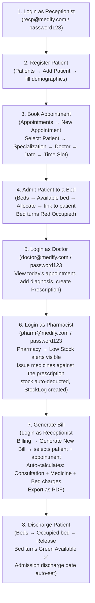

<div align="center">

# 🏥 Medify — Hospital Resource Management System

**A full-stack web application to manage hospital patients, doctors, beds, pharmacy, appointments, and billing — all in one place.**


</div>

---

## 📑 Table of Contents

- [Overview](#-overview)
- [Architecture](#-architecture)
- [Tech Stack](#-tech-stack)
- [User Roles](#-user-roles)
- [Feature Modules](#-feature-modules)
- [Directory Structure](#-directory-structure)
- [Data Models (ERD)](#-data-models)
- [API Reference](#-api-reference)
- [Local Setup (Manual)](#%EF%B8%8F-local-setup)
- [Docker Setup](#-docker-setup)
- [Seeding Demo Data](#-seeding-demo-data)
- [Demo Accounts](#-demo-accounts)
- [Core Demo Flow](#-core-demo-flow)

---

## 🌐 Overview

**Medify** is a production-grade Hospital Resource Management System (HRMS) that digitizes and streamlines hospital operations. It supports four distinct roles (Admin, Receptionist, Doctor, Pharmacist), each with tailored dashboards and capabilities — from registering patients to exporting PDF invoices.

---

## 🏗 Architecture



---

## 🛠 Tech Stack

| Layer        | Technology                                       |
|-------------|--------------------------------------------------|
| Frontend    | React 18 + TypeScript, Vite, Tailwind CSS, Framer Motion |
| Charts      | Recharts                                         |
| Icons       | Lucide React                                     |
| HTTP Client | Axios                                            |
| Backend     | Node.js, Express.js                              |
| Database    | MongoDB + Mongoose ODM                           |
| Auth        | JWT (JSON Web Tokens) + bcrypt                   |
| PDF Export  | PDFKit                                           |

---

## 👥 User Roles

| Role           | Access                                                            |
|----------------|-------------------------------------------------------------------|
| `admin`        | Full access — all modules, dashboard stats, quick actions        |
| `receptionist` | Patients, Appointments, Bed Allocation, Billing                  |
| `doctor`       | View own appointments, add diagnosis/notes, create prescriptions |
| `pharmacist`   | Pharmacy inventory, issue medicines, view stock logs             |

---

## 📦 Feature Modules

### 1. 🧑‍⚕️ Patient Records
- Register patient with full demographics
- Search & filter by name, blood group, contact
- Full patient profile: appointments, admissions, prescriptions, bills
- Edit info; soft-delete (never hard-deletes)

### 2. 🛏 Bed Allocation
- Visual dashboard — color-coded per bed status
  - 🟢 `available` | 🔴 `occupied` | 🟡 `maintenance`
- Group by ward (General / ICU / Private)
- Allocate bed on admission, auto-release on discharge

### 3. 👨‍⚕️ Doctor Schedules
- Filter doctors by specialization or availability date
- View shift timings, available days, consultation fee
- Leave date management

### 4. 📅 Appointment Booking
- Guided flow: Patient → Doctor → Date → Time Slot
- Backend validates no double-booking of a slot
- Status progression: `scheduled` → `confirmed` → `completed` / `cancelled`
- Doctors add diagnosis and notes on completion

### 5. 💊 Pharmacy Inventory
- Stock management with low-stock alerts (red highlight + badge)
- Expiry alerts (≤ 30 days)
- Issue medicines against prescription (auto-deducts stock)
- Full stock history via `StockLogs` collection

### 6. 🧾 Billing
- Auto-calculate on appointment completion or patient discharge
  - Consultation Fee (from Doctor profile)
  - Medicine Charges (Prescription × price/unit)
  - Bed Charges (days stayed × perDayCharge)
- Add miscellaneous charges manually
- Payment status: `Pending` / `Paid` / `Insurance`
- Export as PDF

### 7. 📊 Admin Dashboard
- Patients today / this month
- Bed availability donut chart (Recharts)
- Today's appointment count
- Low stock medicine count (clickable → Pharmacy)
- Pending bills total
- Quick action buttons

---

## 📂 Directory Structure

```
medify/
├── .gitignore                  ← Root gitignore
├── README.md
│
├── client/                     ← React Frontend (Vite + TypeScript)
│   ├── public/
│   ├── src/
│   │   ├── context/
│   │   │   └── AuthContext.tsx      ← JWT auth state + role
│   │   ├── components/
│   │   │   └── ProtectedRoute.tsx   ← Role-based route guard
│   │   ├── layouts/
│   │   │   └── MainLayout.tsx       ← Sidebar + Header shell
│   │   ├── pages/
│   │   │   ├── Login.tsx
│   │   │   ├── Dashboard.tsx
│   │   │   ├── Patients.tsx
│   │   │   ├── Doctors.tsx
│   │   │   ├── Appointments.tsx
│   │   │   ├── Beds.tsx
│   │   │   ├── Pharmacy.tsx
│   │   │   └── Billing.tsx
│   │   ├── App.tsx                  ← Router + route definitions
│   │   ├── main.tsx
│   │   └── index.css                ← Tailwind v4 global styles
│   ├── tailwind.config.js
│   ├── postcss.config.js
│   ├── tsconfig.json
│   └── package.json
│
└── server/                     ← Express Backend
    ├── models/                 ← Mongoose Schemas
    │   ├── users.js
    │   ├── patients.js
    │   ├── doctors.js
    │   ├── beds.js
    │   ├── appointments.js
    │   ├── admissions.js
    │   ├── medicines.js
    │   ├── prescriptions.js
    │   ├── bills.js
    │   └── stocklogs.js
    ├── routes/                 ← Express Route handlers
    │   ├── auth.js
    │   ├── patients.js
    │   ├── doctors.js
    │   ├── beds.js
    │   ├── appointments.js
    │   ├── admissions.js
    │   ├── medicines.js
    │   ├── prescriptions.js
    │   ├── bills.js
    │   └── dashboard.js
    ├── middleware/
    │   └── auth.js             ← JWT protect + authorize middleware
    ├── seed.js                 ← Demo data seeder
    ├── server.js               ← Express app entry point
    ├── .env                    ← Secret variables (git-ignored)
    ├── .env.example            ← Template for env vars
    └── package.json
```

---

## 🗄 Data Models



---

## 🔌 API Reference

| Method | Endpoint                         | Description                            | Access               |
|--------|----------------------------------|----------------------------------------|----------------------|
| POST   | `/api/auth/login`                | Login and receive JWT                  | Public               |
| GET    | `/api/auth/me`                   | Get current user from token            | Private              |
| GET    | `/api/patients`                  | List patients (search + pagination)    | Private              |
| POST   | `/api/patients`                  | Register new patient                   | Admin, Receptionist  |
| GET    | `/api/patients/:id`              | Full patient profile (populated)       | Private              |
| PUT    | `/api/patients/:id`              | Update patient info                    | Admin, Receptionist  |
| DELETE | `/api/patients/:id`              | Soft-delete patient                    | Admin                |
| GET    | `/api/doctors`                   | List doctors (filter by specialization/date) | Private        |
| POST   | `/api/doctors`                   | Add new doctor                         | Admin                |
| PUT    | `/api/doctors/:id`               | Update doctor profile                  | Admin, Doctor        |
| GET    | `/api/beds`                      | List all beds (ward dashboard)         | Private              |
| PUT    | `/api/beds/:id/allocate`         | Allocate bed to patient                | Admin, Receptionist  |
| PUT    | `/api/beds/:id/release`          | Release bed on discharge               | Admin, Receptionist  |
| GET    | `/api/appointments`              | List appointments (role-filtered)      | Private              |
| POST   | `/api/appointments`              | Book an appointment (slot validated)   | Admin, Receptionist  |
| PUT    | `/api/appointments/:id/status`   | Update status / add diagnosis          | Private              |
| POST   | `/api/admissions`                | Admit patient + auto-allocate bed      | Admin, Receptionist  |
| PUT    | `/api/admissions/:id/discharge`  | Discharge + auto-release bed           | Admin, Receptionist  |
| GET    | `/api/medicines`                 | List medicines with pagination         | Private              |
| POST   | `/api/medicines`                 | Add new medicine                        | Admin, Pharmacist    |
| PUT    | `/api/medicines/:id`             | Update medicine info                   | Admin, Pharmacist    |
| POST   | `/api/medicines/:id/stock`       | Add stock + create StockLog            | Admin, Pharmacist    |
| POST   | `/api/prescriptions`             | Create prescription                    | Admin, Doctor        |
| POST   | `/api/prescriptions/:id/issue`   | Issue medicines (deducts stock)        | Admin, Pharmacist    |
| POST   | `/api/bills/generate`            | Auto-generate bill (aggregated)        | Admin, Receptionist  |
| GET    | `/api/bills/:id/export`          | Export bill as PDF                     | Private              |
| GET    | `/api/dashboard`                 | Aggregated admin stats                 | Admin                |

---

## ⚙️ Local Setup

### Prerequisites

- **Node.js** ≥ 18
- **MongoDB** running locally on `mongodb://localhost:27017` or a cloud URI (MongoDB Atlas)
- **npm** ≥ 9

---

### 1. Clone the Repository

```bash
git clone https://github.com/DevanshBehl/medify.git
cd medify
```

---

### 2. Setup the Server

```bash
cd server
npm install
```

Create your `.env` file from the template:

```bash
cp .env.example .env
```

Edit `server/.env`:

```env
PORT=5000
MONGO_URI=mongodb://localhost:27017/medify
JWT_SECRET=your_super_secret_key_here
JWT_EXPIRES_IN=1d
```

---

### 3. Setup the Client

```bash
cd ../client
npm install
```

---

### 4. Start Both Servers

Open **two terminal tabs**:

**Terminal 1 — Backend:**
```bash
cd server
node server.js
# → Server running on port 5000
# → MongoDB Connected
```

**Terminal 2 — Frontend:**
```bash
cd client
npm run dev
# → http://localhost:5173
```

---

## 🐳 Docker Setup

The easiest way to run Medify — no need to install MongoDB or manage multiple terminals.

### Prerequisites
- [Docker Desktop](https://www.docker.com/products/docker-desktop/) installed and running

---

### 1. Clone & Configure Environment

```bash
git clone https://github.com/DevanshBehl/medify.git
cd medify

# Create root .env from template (for JWT secret override)
cp .env.example .env
```

The root `.env` is optional — the JWT secret defaults to a placeholder. For production, set:

```env
JWT_SECRET=your_super_secret_key_here
JWT_EXPIRES_IN=1d
```

> **Note:** `MONGO_URI` is automatically set by Docker Compose (`mongodb://mongo:27017/medify`) — you don't need to configure it.

---

### 2. Build & Start All Services

```bash
docker compose up --build
```

This starts **3 containers** simultaneously:

| Container         | Service              | Port   |
|-------------------|----------------------|--------|
| `medify_mongo`    | MongoDB 7            | 27017  |
| `medify_server`   | Express API          | 5000   |
| `medify_client`   | React (Vite Dev)     | 5173   |

**Access the app:** `http://localhost:5173`

---

### 3. Seed Demo Data (in Docker)

After the containers are running, open a new terminal and run:

```bash
docker exec -it medify_server node seed.js
```

---

### 4. Other Useful Commands

```bash
# Run in background (detached mode)
docker compose up --build -d

# View live logs
docker compose logs -f

# View logs for a specific service
docker compose logs -f server

# Stop all containers
docker compose down

# Stop AND delete the MongoDB data volume (full reset)
docker compose down -v

# Rebuild a single service after code changes
docker compose up --build server
```

---

### Docker Architecture



---

## 🌱 Seeding Demo Data

The seed script inserts all required demo data into MongoDB:

```bash
cd server
node seed.js
```

What gets seeded:
- ✅ **4 users** — one per role
- ✅ **10 patients** — varied demographics
- ✅ **5 doctors** — across specializations
- ✅ **20 beds** — across General, ICU, Private wards
- ✅ **15 medicines** — some below reorder level (triggers alerts)
- ✅ **5 appointments**, 2 admissions, 2 bills

---

## 🔑 Demo Accounts

| Role          | Email                     | Password      |
|---------------|---------------------------|---------------|
| Admin         | `admin@medify.com`        | `password123` |
| Receptionist  | `recp@medify.com`         | `password123` |
| Doctor        | `doctor@medify.com`       | `password123` |
| Pharmacist    | `pharm@medify.com`        | `password123` |

---

## 🔄 Core Demo Flow

Follow this end-to-end walkthrough to verify all modules work together:



---

## 👨‍💻 Author

**Devansh Behl**

---

